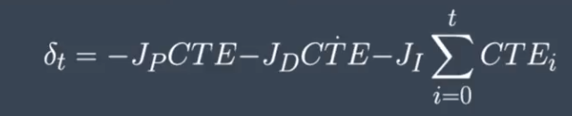

# **PID Controller**

## **Objective**

This project describes implementation of a PID controller to maneuver a vehicle around a track. The PID controller takes cross-track-error as input and returns steering angle as output.

## **Algorithm Overview**

  

The PID controller has three correctional components, each with different goals:

* Proportional (P) - This component is directly proportional to the cross-track-error. When the vehicle veers to the side of the lane, the cross-track-error increases, causing this component to increase. The vehicle will be steered back to the center of the lane.

* Integral (I) - This component is directly proportional to the time-integral of cross-track-error. When the vehicle undercorrects itself during cornering, the cross-track-error increases over time, causing this component to increase. The vehicle will be steered back to prevent going off-road. Furthermore, when the vehicle is unable to correct itself over a long period of time, possibly due to steering bias, this component increases. The vehicle will be steered back.

* Derivative (D) - This component is directly proportional to the rate of change of cross-track-error. When the vehicle undercorrects itself during cornering, the rate of change of cross-track-error increases, causing this component to increase. The vehicle will be steered back to prevent going off-road. Moreover, when the vehicle is steered back to the center of the lane, the rate of change of cross-track-error decreases, causing this component to decrease. The vehicle will be steered back more gracefully to prevent overshooting.

**Tuning**

The following procedures describe how I tune the Kp, Ki and Kd coefficients of the controller:

1. Start with Kp of 0.1, Ki of 0 and Kd of 0.

2. Test the performance with default value of Kp.

3. If undercorrection occurs, increase Kp in the order of 0.3, 1.0, 3.0, ... until overshooting occurs. Take note of Kp with the best performance.

4. If overcorrection occurs, decrease Kp in the order of 0.03, 0.01, 0.003, ... until overshooting stop occurring. Take note of Kp with the best performance.

5. Keep the value of Kp.

6. Repeat step 1-5 for Kd, using the obtained Kp value and Ki value of 0.

7. Repeat step 1-5 for Ki, using the obtained Kp and Kd values.

The final obtained values for Kp, Ki and Kd is 0.3, 0.003 and 3.0 respectively.

**Results**

  

